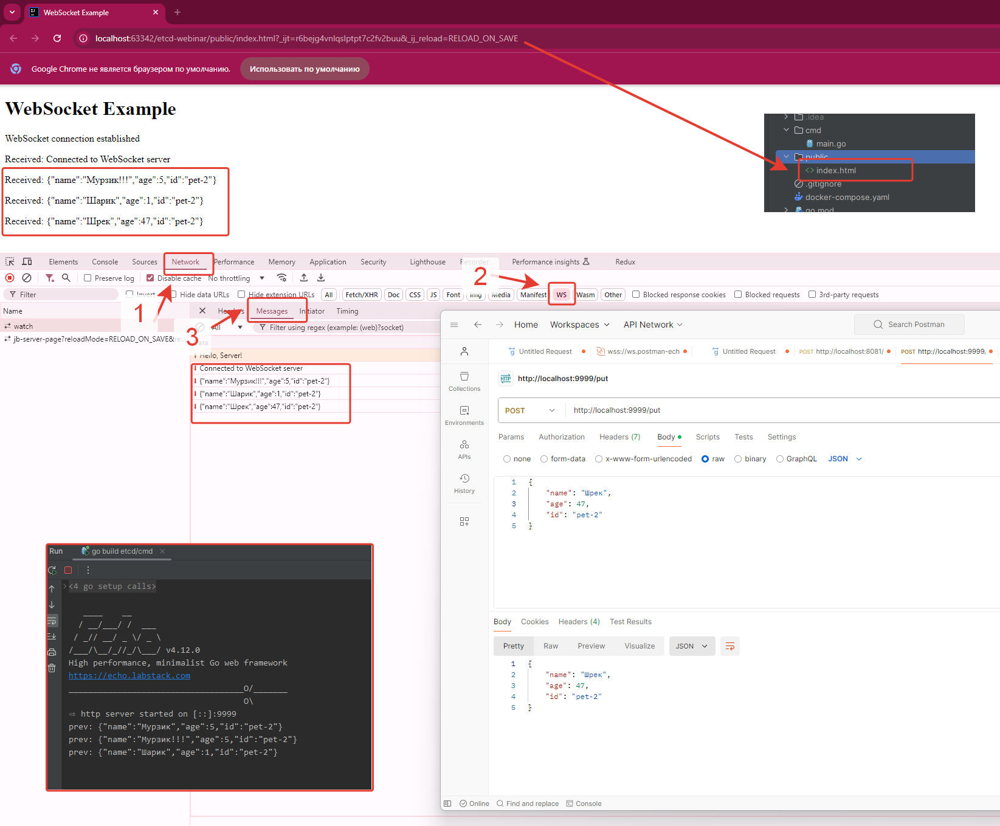

# Демонстрация работы ETCD хранилища
## API сервера для работы с данными о питомцах

Этот сервер предоставляет API для работы с данными о питомцах, используя etcd в качестве хранилища данных. API поддерживает операции создания, чтения, обновления и удаления (CRUD), а также предоставляет возможность наблюдения за изменениями данных в реальном времени через WebSocket.



## Эндпоинты

### 1. Получение данных о питомце (GET)

**Запрос:**
```
GET http://localhost:9999/get?id=<id питомца>
```

**Пример:**
```
GET http://localhost:9999/get?id=pet-1
```

**Ответ:**
```json
{
    "name": "Барсик",
    "age": 3,
    "id": "pet-1"
}
```

### 2. Добавление или обновление данных о питомце (POST)

**Запрос:**
```
POST http://localhost:9999/put
Content-Type: application/json

{
    "name": "Мурзик",
    "age": 5,
    "id": "pet-2"
}
```

**Ответ:**
```json
{
    "name": "Мурзик",
    "age": 5,
    "id": "pet-2"
}
```

### 3. Удаление данных о питомце (DELETE)

**Запрос:**
```
DELETE http://localhost:9999/delete?id=<id питомца>
```

**Пример:**
```
DELETE http://localhost:9999/delete?id=pet-2
```

**Ответ:**
```
ok
```

### 4. Наблюдение за изменениями (WebSocket)

Для наблюдения за изменениями данных в реальном времени используется WebSocket соединение.

**URL для подключения:**
```
ws://localhost:9999/watch
```

Важно отметить, что наблюдатель (watcher) настроен на отслеживание всех ключей с префиксом "put/". Это означает, что только изменения ключей, начинающихся с "put/", будут отправляться на веб-страницу через WebSocket соединение.

## Примеры использования

### Добавление питомца с префиксом "put/"

```
POST http://localhost:9999/put
Content-Type: application/json

{
    "name": "Шарик",
    "age": 2,
    "id": "put/dog-1"
}
```

Это изменение будет отправлено через WebSocket на веб-страницу.

### Добавление питомца без префикса "put/"

```
POST http://localhost:9999/put
Content-Type: application/json

{
    "name": "Мурка",
    "age": 4,
    "id": "cat-1"
}
```

Это изменение НЕ будет отправлено через WebSocket на веб-страницу, так как id не начинается с "put/".

### Получение данных о питомце

```
GET http://localhost:9999/get?id=put/dog-1
```

### Удаление питомца

```
DELETE http://localhost:9999/delete?id=put/dog-1
```

## Заключение

Этот API предоставляет полный набор операций CRUD для работы с данными о питомцах, а также возможность наблюдения за изменениями в реальном времени. При использовании API помните о префиксе "put/" для id, если вы хотите, чтобы изменения отображались на веб-странице через WebSocket.

Обратите внимание на формат идентификаторов: для отслеживания изменений через WebSocket они должны начинаться с "put/", за которым следует уникальный идентификатор. Например: "put/dog-1", "put/cat-3" и т.д. Идентификаторы без префикса "put/" также допустимы, но изменения по ним не будут отслеживаться через WebSocket.
